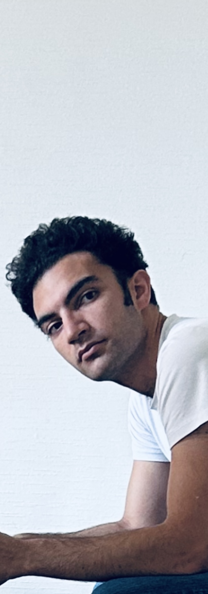

<!-- {: style="float: right; margin: 0px 20px; width: 70px; height: 250px" name="fox"} -->

<!-- {: style="float: right; margin: 0px 20px; width: 204px; height: 300px" name="fox"} -->

<!-- {: style="display:block; margin-left: auto; margin-right: auto; width: 204px; height: 300px" name="fox"}
 -->

<!--  -->

<!--
Twitter: 
Incoming PhD student @INRIA Parietal team, Machine Learning and Computational Neuro. 
Former intern @FacebookAI. 
-->

<!-- I am a PhD student in machine learning at Inria Paris-Saclay. I currently work on efficient estimation of energy-based models and self-supervised learning. -->

<!--
More generally, I am interested in the inferential and dynamics-with-control viewpoints on learning and computation in the brain, and what they suggest about how the brain encodes and processes (visual, auditory, linguistic) stimuli. We use neuroimaging data as a proxy for the neural code, investigating its structure (grammar) in a top-down approach, using unsupervised representation learning, or conversely emulating it using mechanistic biophysical models in a bottom-up approach.

I furthermore believe the Machine Learning community has much to gain from leveraging a more precise understanding of neuroscience topics, such as synaptic intelligence, stochastic dynamics, neural code, memory, and the different strata of analyses (from cellular to network to whole-brain), for example. 

I've previously interned at Facebook AI Research, ENS Paris, U of Toronto with <a href="http://probability.ca/jeff/" target="_blank">Jeff Rosenthal</a>, Inria Parietal and AXA France.
-->

<!--
## News 

* 03/2021 _Our work is featured in towardsdatascience, as_ <a href="https://towardsdatascience.com/stay-updated-with-neuroscience-march-2021-must-reads-bf19bd73560e" target="_blank">March Must-Reads</a>

* 08/2020 _Our work is featured in Andrew Ng's Deep Learning Newsletter_ <a href="https://blog.deeplearning.ai/blog/the-batch-training-1-trillion-parameters-medical-ai-gets-a-shot-in-the-arm-does-bert-have-common-sense-revitalizing-chess" target="_blank">The Batch!</a>, as 'Unlabeled Brain Waves Spill Secrets'
-->

###  About 

I am currently a postdoctoral fellow in the <a href="https://crest.science/research/research-fields/statistics/" target="_blank" rel="noopener">Statistics Department</a> of ENSAE-CREST, working with <a href="https://akorba.github.io" target="_blank" rel="noopener">Anna Korba</a>. I received my PhD in Computer Science at <a href="https://www.inria.fr/en" target="_blank" rel="noopener">Inria</a>, where I was advised by <a href="https://www.cs.helsinki.fi/u/ahyvarin/" target="_blank" rel="noopener">Aapo Hyvärinen</a> and <a href="http://alexandre.gramfort.net" target="_blank" rel="noopener">Alexandre Gramfort</a>.

My research is on machine learning and statistics. More specifically, I work on estimating and sampling energy-based models, on density-ratio estimation, and on representation learning for brain imaging data. My latest work has been to study optimal distribution paths for (annealed) importance sampling.

<!-- I am a postdoctoral research fellow in the <a href="https://crest.science/research/research-fields/statistics/" target="_blank">Statistics Department</a> of the Center for Research in Economics and Statistics (CREST), working with <a href="https://akorba.github.io" target="_blank">Anna Korba</a> on the development and analysis of sampling algorithms <a href="https://simons.berkeley.edu/programs/geometric-methods-optimization-sampling" target="_blank">from an optimization perspective</a>.

I completed my Ph.D. at <a href="https://www.inria.fr/en" target="_blank">Inria</a> under the supervision of <a href="https://www.cs.helsinki.fi/u/ahyvarin/" target="_blank">Aapo Hyvärinen</a> and <a href="http://alexandre.gramfort.net" target="_blank">Alexandre Gramfort</a>, focusing on self-supervised learning, its statistical aspects and its applications to cognitive neuroscience. I also hold a master’s degree in engineering from ENSTA Paris and another in machine learning (MVA) from ENS Paris-Saclay. -->

<!-- I am currently working on self-supervised learning which consists in having a machine learn patterns from data by solving a prediction task. 
I also have an applicative interest in neuroscience, namely in how to learn "good" representations of brain activity.  -->

<!-- I am a postdoctoral research fellow at CREST - Center for Research in Economics and Statistics - in France, working with <a href="https://akorba.github.io" target="_blank">Anna Korba</a> on algorithms for sampling data.  -->

<!-- For example, if the data is a book, one task you can give the machine is to recognize sentences of the book where the words are ordered from sentences where the words are scrambled. To solve this task, the machine might have to identify grammatical rules and writing style, and would therefore learn meaningful stuff from the book. I have been interested in two key questions: <i>what exactly is being learnt from such tasks? and what makes a task better than another?</i>  -->

<!-- I obtained a PhD from Mila (Université de Montréal) under the supervision of Aaron Courville. In my thesis, I investigated deep learning methods for visual dialogue applications. I was also fortunate enough to spend time at the research labs of Facebook, Twitter, and INRIA. -->

You can reach me at <i>emir.chehab [AT] ensae.fr</i>

<!--   -->

<!-- ###  Research  -->

<!-- <b>What is being learnt from a self-supervised task?</b>  -->
<!-- We provide some answers in our recent work, using tools from energy-based modeling, asymptotic statistics, information geometry, and classification. For example, we <a href="https://arxiv.org/abs/2301.09696" target="_blank">here</a> connected a basic self-supervised task (classifying between data and noise) to a family of importance sampling estimators that are well-established in statistics. In some other work, we also look at the optimal way to break down an easy task (e.g. hot vs. cold) in a series of harder ones (e.g. hot vs. warm, warm vs. cold). -->

<!-- <b>How do we design self-supervised tasks to be sample-efficient?</b>  -->

<!-- My work is funded by European (ERC) and French (ANR) grants "Signal And Learning Applied To Brain Data" and "Bridging Artificial Intelligence and Neuroscience". I am also affiliated to <a href="http://joliot.cea.fr/drf/joliot/en/Pages/research_entities/NeuroSpin/unicog.aspx" target="_blank">NeuroSpin</a>. -->

 

###  Publications 

<!-- (See also my <a href="https://scholar.google.com/citations?user={{site.scholar_id}}" target="_blank">google scholar</a>) -->

<!-- ####  Optimization and Sampling  -->

####  Self-Supervised Learning and Statistical Estimation 






    

        
    

    

        <b style="letter-spacing:0.7px;">{{ hash.title }}</b> 
         
        {{ hash.authors }}
         
        <i>{{ hash.venue_name }}, {{ hash.year }}.</i>
         
        <!-- Links to paper (if exists)  -->
        
        <a href="{{ hash.url_paper }}" target="_blank">Paper</a>
        &nbsp;
        
        <!-- Links to poster (if exists)  -->
        
        <a href="/documents/posters/{{ hash.poster_file }}" target="_blank">Poster</a>
        &nbsp;
        
        <!-- Links to code (if exists)  -->
        
        <a href="{{ hash.url_code }}" target="_blank">Code</a>
        &nbsp;
        
        <!-- Copy bibtex (if exists)  -->
        <!--  -->
        <!-- <button onclick="copyText()">Bibtex</button> -->
        <!--  -->
        <!-- One-sentence summary  -->
        

        {{ hash.summary }}
        

    





<!-- 
 -->

####  Deep Learning and Cognitive Neuroscience 






    

        
    

    

        <b style="letter-spacing:0.7px;">{{ hash.title }}</b> 
         
        {{ hash.authors }}
         
        <i>{{ hash.venue_name }}, {{ hash.year }}.</i>
        <!-- Distinction for paper (if exists)  -->
        
        {{ hash.distinction }}.
        
         
        <!-- Links to paper (if exists)  -->
        
        <a href="{{ hash.url_paper }}" target="_blank">Paper</a>
        &nbsp;
        
        <!-- Links to poster (if exists)  -->
        
        <a href="/documents/posters/{{ hash.poster_file }}" target="_blank">Poster</a>
        &nbsp;
        
        <!-- Links to code (if exists)  -->
        
        <a href="{{ hash.url_code }}" target="_blank">Code</a>
        &nbsp;
        
        <!-- Copy bibtex (if exists)  -->
        <!--  -->
        <!-- <button onclick="copyText()">Bibtex</button> -->
        <!--  -->
        <!-- One-sentence summary  -->
        

        {{ hash.summary }}
        

    





<!-- 

    

        
    

    

        <b style="letter-spacing:0.7px;">A mean-field approach to the dynamics of networks of complex neurons, from nonlinear Integrate-and-Fire to Hodgkin-Huxley models</b>  
        M. Carlu*, <i>O. Chehab</i>*, [...], A. Destexhe, M. di Volo  
        <i>Journal of Neurophysiology, 2020.</i>
         
        <a href="https://www.biorxiv.org/content/10.1101/870345v1" target="_blank">Paper</a>
        

        Mean-Field analysis can effectively summarize complex network dynamics that model neuronal activity.
        
 
    

 -->

 

###  Teaching 

I was Teacher's Assistant for the following Masters courses. 




