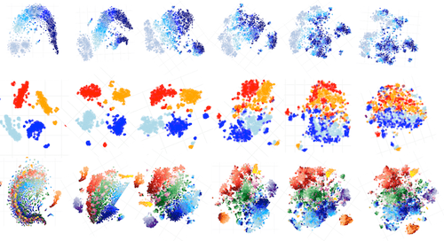

This is a post for the EMNLP 2019 paper
    <a href="https://arxiv.org/abs/1909.01380">
            The Bottom-up Evolution of Representations in the Transformer: A Study with Machine Translation and Language Modeling Objectives.
    </a>

 
 

We look at the evolution of representations of individual tokens in Transformers trained with different
    training objectives (MT, LM, MLM - BERT-style) from the
    <a href="https://www.cs.huji.ac.il/labs/learning/Papers/allerton.pdf">Information Bottleneck</a>
    perspective and show, that:
<ul>
  <li>LMs gradually forget past when forming predictions about future;</li>
  <li>for MLMs, the evolution proceeds in two stages of
      context encoding and token reconstruction;</li>
    <li>MT representations get refined with context,
        but less processing is happening.</li>
</ul>

September 2019

<!-- Lightweight client-side loader that feature-detects and load polyfills only when necessary -->

<!-- Load the element definition -->

<!-- Simply set the `src` attribute to your MD file and win -->
<zero-md src="testing.md"></zero-md>

  

Want to know more?

  
Share: <a href="https://twitter.com/share?ref_src=twsrc%5Etfw" class="twitter-share-button" data-text="A View on the Evolution of Representations in the Transformer from the Information Bottleneck Perspective: a post on the EMNLP 2019 paper" data-url="https://lena-voita.github.io/posts/emnlp19_evolution.html" data-lang="en" data-show-count="false">Tweet</a>
